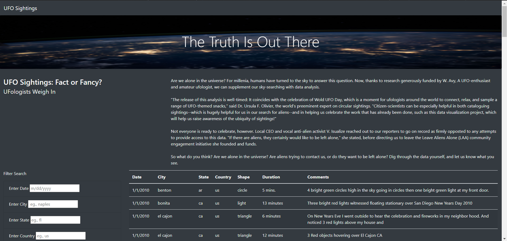

# UFOs
## **Project Overview**
---
The purpose of this project is to extract UFO sighting data from a JavaScript array and display filtered results in a webpage table using HTML.

## **Results**
---

### *The Homepage*

When first accessing the webpage, no filters will be applied and all available data will be displayed in the table.

### *Filtering on one parameter*

To filter on a single parameter, enter value (eg., 1/10/2010) into corresponding input box (eg., date) and press ENTER. The page will reload with the table now displaying only the filtered results. You may clear the filter either by clicking the 'UFO Signtings' homepage button, or by deleting the input value from the input box. [**NOTE:** you must enter values in specified format (eg., m/dd/yyy) or you won't return results.]

 

### *Filtering on multiple parameters*

To filter on multiple parameters, enter values into corresponding boxes and press ENTER. The page will reload table with results matching all specified values. You may clear filters individually by deleting the values from their input boxes, or clear all the filters by clicking the 'UFO Sightings' homepage button.  

 

## Summary
***
### *Drawbacks*
One drawback of this design is the user can't readily view the possible values for each filter. To fix this, each input box could have a dropdown of possible values to choose from. 

Another recommendation is to add two buttons to the 'Filter Search' box- a 'Search' button to initiate the filtered search, and a 'Clear Filters' button to clear all filters. This would prevent the page from reloading until all desired filters are selected and would make clearing all filters more straightforward. 